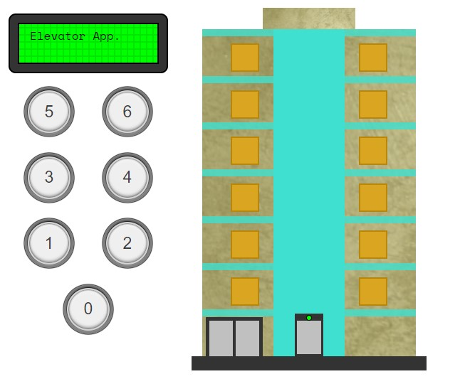

# Elevator app build with JavaScript

# Live demo

> https://elevator-app-rc.herokuapp.com/



## Table of contents

- [General info](#general-info)
- [Code Examples](#code-examples)
- [Features](#features)
- [Contact](#contact)

## General info

Project idea from freecodecamp: More project ideas to improve your coding skills

https://www.freecodecamp.org/news/more-project-ideas-to-improve-your-coding-skills-99f48d09bb4b/

- Coded by me using basic OOP
- The idea and design was taken from Arthur Annical CodePen https://codepen.io/nibalAn/pen/prWdjq
- The code has been completed only with JavaScript

## Code Examples

./js/script.js

```
import Elevator from './Elevator.js';

//select all btns
const AllbuttonFloor = document.querySelectorAll('.btn-floor');
const ELEVATOR_TOTAL_DISTANCE = 392; // total distance from bottom to top
const ELEVATOR_FLOOR_DISTANCE = 65.33; // total distance each floor

// generates instace of a class Elevator
const elevator = new Elevator(ELEVATOR_TOTAL_DISTANCE, ELEVATOR_FLOOR_DISTANCE);

//return current elevator position and elevator element
const elevatorPosition = () => {
  const elevator = document.querySelector('.elevator');

  const style = getComputedStyle(elevator);
  return [style.bottom.split('px')[0], elevator];
};

//handle click event
function handleClick(e) {
  elevator.buttonPressed(e.target);
}

//listen to click event on  each btn
AllbuttonFloor.forEach((btn) => btn.addEventListener('click', handleClick));

export { elevatorPosition, elevator };
```

## Features

You can:

- Do the usual stuff that you could do on an elevator

## Technology used

The project is created with:

- JavaScript

## Contact

Coded by Cudi - feel free to contact me!
